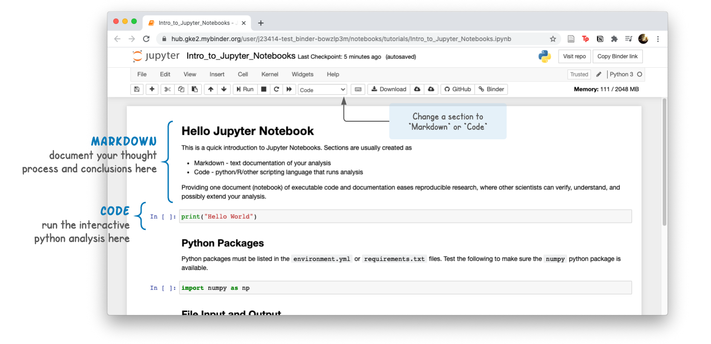
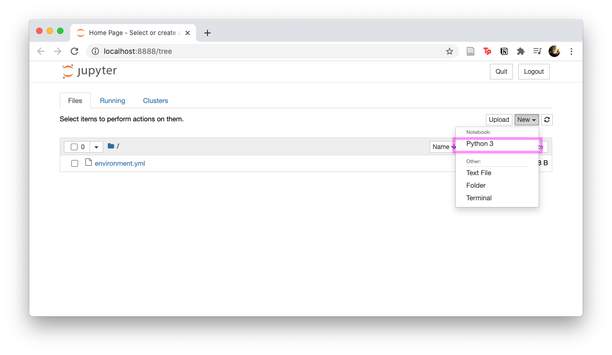
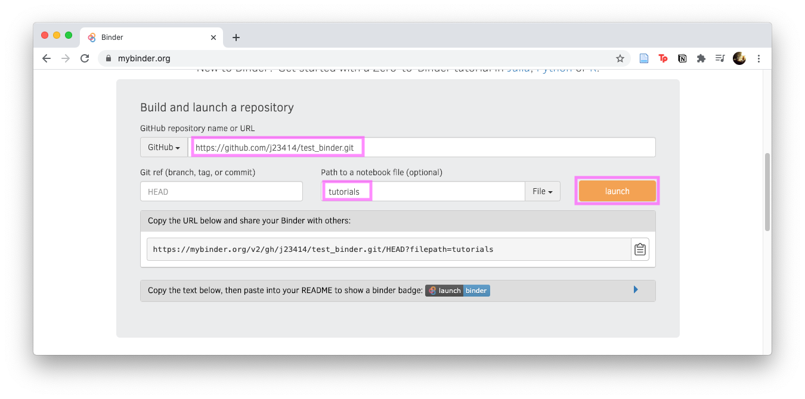

# Sharing Jupyter Notebooks via MyBinder

Testing Jupyter Notebook binder

[](https://mybinder.org/v2/gh/j23414/test_binder.git/HEAD?filepath=tutorials)

## Introduction

Bioinformatic analysis pipelines written in python can be shared in an interactive document called a Jupyter Notebook. Notebooks generally have two sections:

* Markdown - text/documentation of your analysis
* Code - Python code chunks that run the analysis



Providing one document (notebook) of executable code and documentation eases reproducible research, where other scientists can verify, understand, and possibly extend your analysis.

To demonstrate these benefits, this tutorial will walk you through:

* creating a minimal Jupyter Notebook
* pushing it to a public github
* and linking the notebook to a mybinder.org to be shared

## Step 1: GitHub

You will need a GitHub account (register here). From there, create a new github repo:

 


## Setup

```bash
cd test_binder/tutorials
conda env create -f environment.yml
```

**environment.yml**

```yaml
name: ntbk_env
channels:
  - conda-forge
  - bioconda
  - defaults
dependencies:
  - python=3.8
  - jupyter
```

```bash
conda activate ntbk_env      # start
conda deactivate             # stop
```

## Create a Notebook

```bash
conda activate ntbk_env
jupyter notebook               # Starts server
```

Create a Jupyter Notebook via `New/Python 3`



## Link to binder

* Visit [https://mybinder.org/](https://mybinder.org/)
* Input the github name and any subfolder if ipynb files are in a subfolder



[](https://mybinder.org/v2/gh/j23414/test_binder.git/HEAD?filepath=tutorials)

## Python Module dependencies

MyBinder will look for a `environment.yml` or a `requirements.txt` to find a list of python modules to install. This file needs to be at the base of the github repo (can't find it inside of subfolder `tutorials`)
