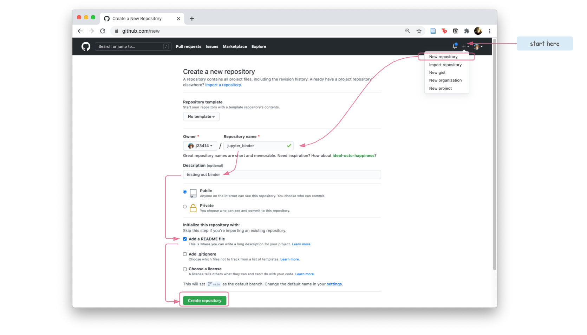
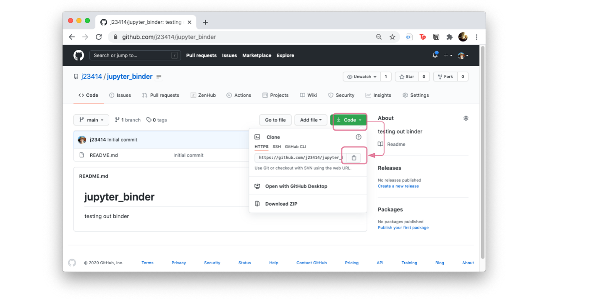

# Sharing Jupyter Notebooks via MyBinder

Testing Jupyter Notebook binder

[](https://mybinder.org/v2/gh/j23414/test_binder.git/HEAD?filepath=tutorials)

## Introduction

Bioinformatic analysis pipelines written in python can be shared in an interactive document called a [Jupyter Notebook](https://jupyter.org/). Notebook sections are usually one of two types:

* Markdown - text/documentation of your analysis
* Code - Python code chunks that run the analysis


Providing one document (notebook) of executable code and documentation eases reproducible research, where other scientists can verify, understand, and possibly extend your analysis.

To demonstrate these benefits, this tutorial will walk you through:

* creating a minimal Jupyter Notebook
* pushing it to a public github
* and linking the notebook to a mybinder.org to be shared

We will assume you have a GitHub account and are using `conda` to manage python environments.

## Step 1: GitHub

We will assume you have a GitHub account. If not, please register a free account.

1. Sign in to Github - [https://github.com/](https://github.com/)
2. Create a `jupyter_binder` repository

  

3. Clone the repo, to create a copy on your local compuer.

  

  ```
  git clone https://github.com/YOUR_USER_NAME/jupyter_binder.git
  cd jupyter_binder
  ```
  
  We will be adding a basic notebook to this folder, and pushing (publishing) it to GitHub.

## Step 2: Create a minimal Jupyter Notebook

<!--
### A note about Python Environments

Since there are often conflicts between different versions of python modules, we highly recommend you use a envirnoment manager (`venv` or `conda`). For this tutorial, we will assume you are using `conda`.
-->

Creating and hosting a local Jupyter Notebook requires the `jupyter` package. 

1. Use your favorite Text Editor and copy the following file, saving it as a **environment.yml** file. Notice how we've named the environment `ntbk_env`.

  ```yml
name: ntbk_env
channels:
  - conda-forge
  - bioconda
  - defaults
dependencies:
  - python=3.8        #<= python version
  - jupyter           #<= list any python packages here
```

2. Create the python environment. From terminal, we can use `conda env create` to create a python environment. The `-f` flag means we are reading in dependencies from a file `environment.yml`. Creating an environment may take several minutes.

  ```{bash}
  conda env create -f environment.yml
  ```

3. Activate the environment.

  ```{bash}
  conda env list             # List all created environments
  conda activate ntbk_env    # Start the ntbk_env
  conda deactivate           # Stops the ntbk_env
  ```
  
4. Start the local Jupyter Notebook

  ```{bash}
  cd jupyter_binder/         # Navigate to git repo
  mkdir tutorials            # Create a folder
  conda activate ntbk_env    # Start ntbk_env
  jupyter notebook           # Starts notebook, should open a browser window
  ```
  


5. Create a Jupyter Notebook via `New/Python 3`


6. Try to recreate the Jupyter Notebook shown in the figure.


7. Save and commit to GitHub

  ```bash
  git add tutorials/Intro_to_Jupyter_Notebooks.ipynb
  git add environment.yml
  git commit -m "minimal notebook" tutorials/Intro_to_Jupyter_Notebooks.ipynb environment.yml
  git push origin main
  ```

## Link to binder

* Visit [https://mybinder.org/](https://mybinder.org/)
* Input the github name and any subfolder if ipynb files are in a subfolder


[](https://mybinder.org/v2/gh/j23414/test_binder.git/HEAD?filepath=tutorials)

## Python Module dependencies

MyBinder will look for a `environment.yml` or a `requirements.txt` to find a list of python modules to install. This file needs to be at the base of the github repo (can't find it inside of subfolder `tutorials`)

<!-- SCRAP AFTER THIS
## Setup

```bash
cd jupyter_binder
conda env create -f environment.yml
```

**environment.yml**

  ```yaml
  name: ntbk_env
  channels:
    - conda-forge
    - bioconda
    - defaults
  dependencies:
    - python=3.8
    - jupyter
  ```

```bash
conda activate ntbk_env      # start
conda deactivate             # stop
```

## Create a Notebook

```bash
conda activate ntbk_env
jupyter notebook               # Starts server
```
-->
